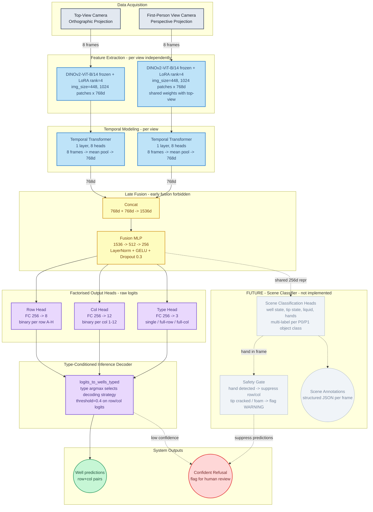

**Legend**
- Solid coloured borders — implemented and running
- Light grey (`future` class) — proposed, not yet in codebase
- Dotted edges — future data flows (not yet implemented)

> **Scene Classifier** full spec: [FEATURE_SCENE_CLASSIFICATION.md](FEATURE_SCENE_CLASSIFICATION.md)
> **Audio/acoustic modality** is deferred (Architecture D) — not shown.
