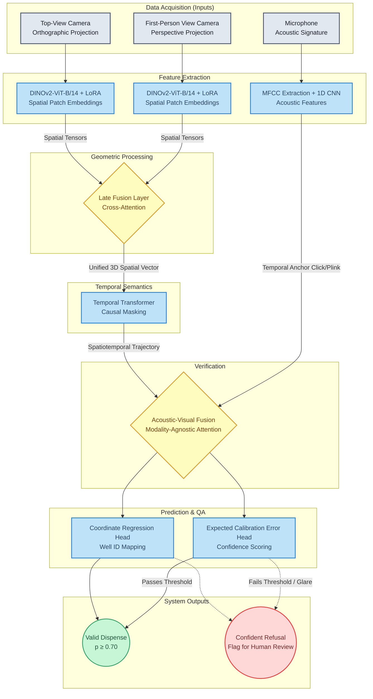

```mermaid
graph TD
    %% Input Layer
    subgraph Inputs ["Data Acquisition (Inputs)"]
        TV[Top-View Camera<br/>Orthographic Projection]
        FPV[First-Person View Camera<br/>Perspective Projection]
        AUD[Microphone<br/>Acoustic Signature]
    end

    %% Feature Extraction Layer
    subgraph FeatureExtraction ["Feature Extraction"]
        DINO_TV[DINOv2-ViT-B/14 + LoRA<br/>Spatial Patch Embeddings]
        DINO_FPV[DINOv2-ViT-B/14 + LoRA<br/>Spatial Patch Embeddings]
        MFCC[MFCC Extraction + 1D CNN<br/>Acoustic Features]
    end

    %% Spatial Fusion
    subgraph SpatialFusion ["Geometric Processing"]
        LATE_FUSION{Late Fusion Layer<br/>Cross-Attention}
    end

    %% Temporal Processing
    subgraph TemporalProcessing ["Temporal Semantics"]
        TEMP_TRANSFORMER[Temporal Transformer<br/>Causal Masking]
    end

    %% Multimodal Fusion
    subgraph MultimodalFusion ["Verification"]
        MM_FUSION{Acoustic-Visual Fusion<br/>Modality-Agnostic Attention}
    end

    %% Prediction Layer
    subgraph Prediction ["Prediction & QA"]
        REGRESSION[Coordinate Regression Head<br/>Well ID Mapping]
        CONFIDENCE[Expected Calibration Error Head<br/>Confidence Scoring]
    end

    %% Output Layer
    subgraph Outputs ["System Outputs"]
        DISPENSE((Valid Dispense<br/>p ≥ 0.70))
        REFUSAL((Confident Refusal<br/>Flag for Human Review))
    end

    %% Data Flow Edges
    TV --> DINO_TV
    FPV --> DINO_FPV
    AUD --> MFCC

    DINO_TV --> |Spatial Tensors| LATE_FUSION
    DINO_FPV --> |Spatial Tensors| LATE_FUSION

    LATE_FUSION --> |Unified 3D Spatial Vector| TEMP_TRANSFORMER
    
    TEMP_TRANSFORMER --> |Spatiotemporal Trajectory| MM_FUSION
    MFCC --> |Temporal Anchor Click/Plink| MM_FUSION

    MM_FUSION --> REGRESSION
    MM_FUSION --> CONFIDENCE

    REGRESSION --> DISPENSE
    CONFIDENCE --> |Passes Threshold| DISPENSE
    
    REGRESSION -.-> REFUSAL
    CONFIDENCE -.-> |Fails Threshold / Glare| REFUSAL

    %% Styling
    classDef input fill:#e2e8f0,stroke:#4a5568,stroke-width:2px,color:#1a202c
    classDef model fill:#bee3f8,stroke:#3182ce,stroke-width:2px,color:#2a4365
    classDef fusion fill:#fefcbf,stroke:#d69e2e,stroke-width:2px,color:#744210
    classDef output_pass fill:#c6f6d5,stroke:#38a169,stroke-width:2px,color:#22543d
    classDef output_fail fill:#fed7d7,stroke:#e53e3e,stroke-width:2px,color:#742a2a

    class TV,FPV,AUD input
    class DINO_TV,DINO_FPV,MFCC,TEMP_TRANSFORMER,REGRESSION,CONFIDENCE model
    class LATE_FUSION,MM_FUSION fusion
    class DISPENSE output_pass
    class REFUSAL output_fail
```    