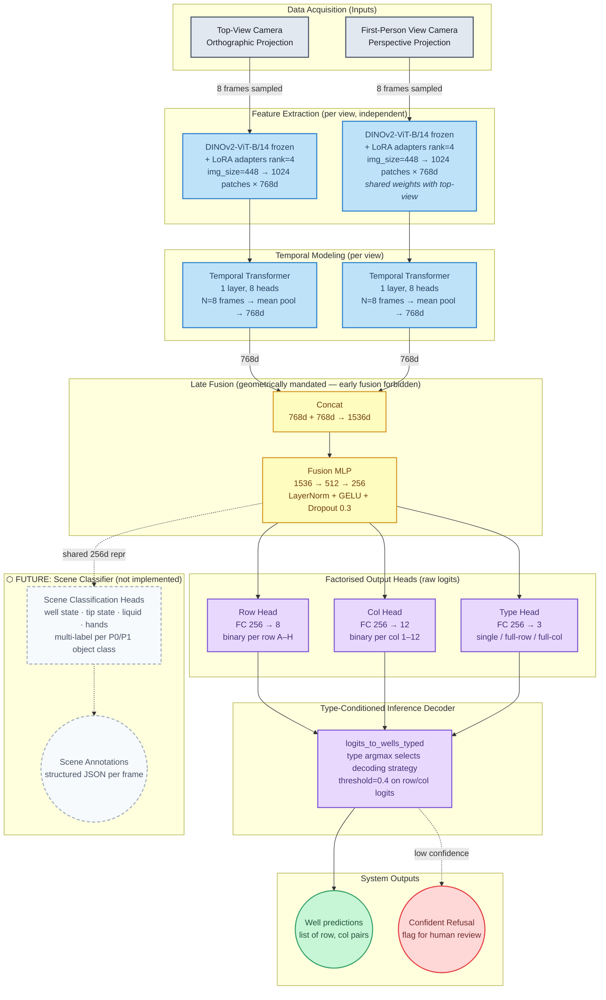

**Legend**
- Solid borders — implemented and running in production training
- Dashed grey borders — proposed future features, not yet in codebase

> **Audio/acoustic modality** is also deferred (Architecture D in ARCHITECTURE.md) — not shown here as it is not yet specced at the diagram level.
> **Scene Classifier** full spec: [`docs/FEATURE_SCENE_CLASSIFICATION.md`](FEATURE_SCENE_CLASSIFICATION.md)
